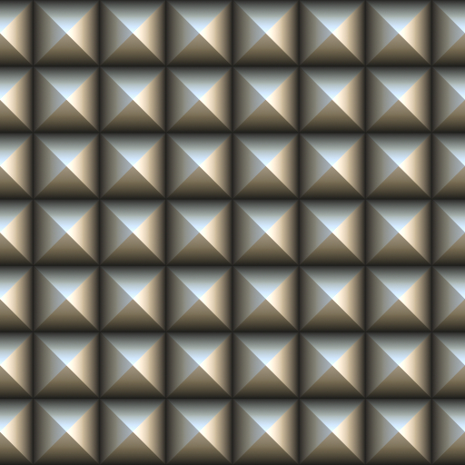
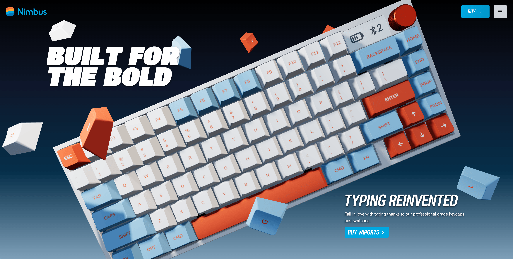
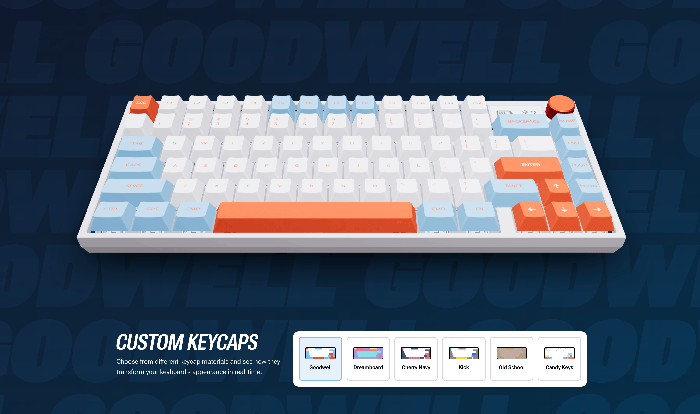
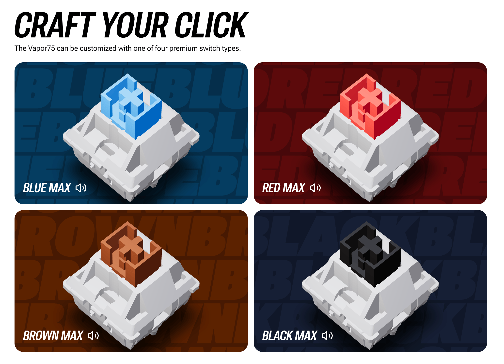
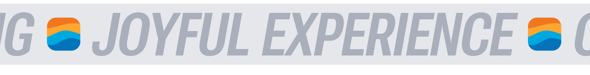
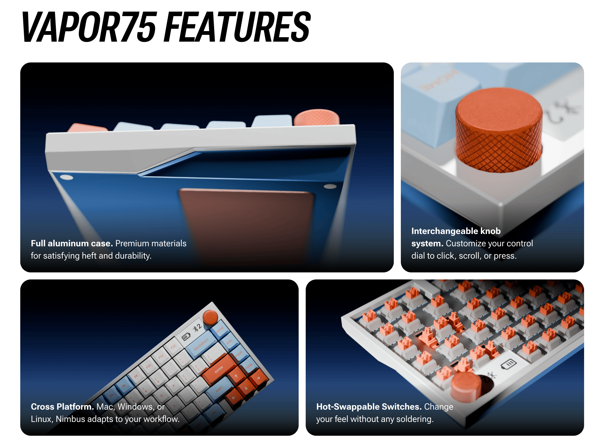
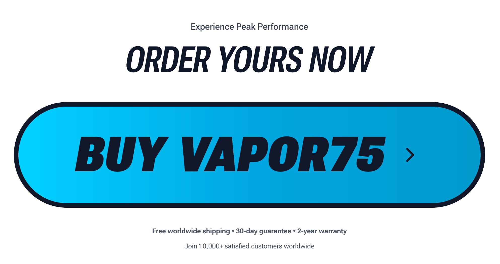

# 🚀 Nimbus Keyboard

> **A premium keyboard showcase website featuring immersive 3D animations and interactive scroll experiences**

[](https://nextjs.org/)
[](https://reactjs.org/)
[](https://threejs.org/)
[](https://greensock.com/gsap/)
[](https://tailwindcss.com/)
[](https://www.typescriptlang.org/)

<!-- <div align="center">
  
</div> -->

## ✨ Features

### 🎬 **Immersive 3D Experience**
- **Interactive 3D Keyboard Models** with realistic lighting and materials
- **Scroll-triggered Animations** powered by GSAP ScrollTrigger
- **Mouse Parallax Effects** for enhanced user engagement
- **Dynamic Camera Controls** with smooth transitions

### 🎨 **Interactive Components**
- **Real-time Keycap Color Changer** - Customize keyboard aesthetics
- **Switch Playground** - Explore different mechanical switches
- **Animated Hero Section** with wave effects and smooth reveals
- **Dynamic Marquee** with bidirectional text scrolling

### 💻 **Modern Tech Stack**
- **Next.js 15.5.4** with Turbopack for lightning-fast builds
- **React 19** with latest features and optimizations
- **Three.js & React Three Fiber** for 3D graphics
- **GSAP** for professional animations
- **Tailwind CSS 4.0** for modern styling
- **Prismic CMS** for content management

### 🛒 **Business Ready**
- **Purchase Integration** with checkout system
- **Responsive Design** across all devices
- **SEO Optimized** with Next.js best practices
- **CMS-Driven Content** for easy management

## 🎯 Live Demo

**[View Live Site →](https://your-deployed-url.com)**

## 📸 Screenshots

<div align="center">

### 🏠 Hero Section


### 🎨 Color Changer


### 🎛️ Switch Playground  


### 🏃‍♂️ Marquee Section


### 📦 Features Grid


### 💳 Purchase Section


</div>

## 🚀 Quick Start

### Prerequisites

- **Node.js** 18+ 
- **Bun** (recommended) or npm/yarn
- **Git**

### Installation

1. **Clone the repository**
```bash
git clone https://github.com/yourusername/nimbus-keyboard.git
cd nimbus-keyboard
```

2. **Install dependencies**
```bash
bun install
# or
npm install
```

3. **Set up environment variables**
```bash
# Create .env.local file
cp .env.example .env.local

# Add your Prismic repository details
NEXT_PUBLIC_PRISMIC_ENVIRONMENT=your-repo-name
PRISMIC_ACCESS_TOKEN=your-access-token
```

4. **Run the development server**
```bash
bun dev
# or
npm run dev
```

5. **Open your browser**
```
http://localhost:3000
```

## 🛠️ Available Scripts

| Command | Description |
|---------|-------------|
| `bun dev` | Start development server with Turbopack |
| `bun build` | Build for production |
| `bun start` | Start production server |
| `bun lint` | Run ESLint |
| `bun slicemachine` | Start Prismic Slice Machine |

## 🏗️ Project Structure

```
nimbus-keyboard/
├── 📁 public/              # Static assets
│   ├── 🖼️ *.jpg            # Keyboard images
│   └── 🎨 *.png            # Textures & materials
├── 📁 src/
│   ├── 📁 app/             # Next.js app directory
│   ├── 📁 components/      # Reusable components
│   │   ├── 🎹 Keyboard/    # 3D keyboard component
│   │   ├── 🔘 Keycap/      # Individual keycap
│   │   ├── 🎛️ Switch/      # Switch component
│   │   ├── 🧭 Nav-bar/     # Navigation
│   │   ├── 👥 Footer/      # Footer
│   │   └── ⚡ Loader/      # Loading screen
│   ├── 📁 slices/          # Prismic slices
│   │   ├── 🎬 Hero/        # Hero section
│   │   ├── 🎨 ColorChanger/ # Color customization
│   │   ├── 🎛️ SwitchPlayground/ # Switch interaction
│   │   ├── 🏃‍♂️ Marquee/    # Scrolling text
│   │   ├── 📦 BentoBox/    # Features grid
│   │   └── 💳 PurchaseButton/ # CTA section
│   └── 📁 checkout/        # Purchase logic
├── 📁 customtypes/         # Prismic schemas
└── 📄 Configuration files
```

## 🎨 Key Components

### 🎹 3D Keyboard (`/src/components/Keyboard/`)
- **Realistic Materials**: PBR textures and lighting
- **Interactive Elements**: Clickable keys and switches
- **Performance Optimized**: Efficient rendering and memory usage

### 🎨 Color Changer (`/src/slices/ColorChanger/`)
- **Real-time Preview**: Instant keycap color updates
- **Material Variants**: Multiple texture options
- **Smooth Transitions**: GSAP-powered color morphing

### 🎛️ Switch Playground (`/src/slices/SwitchPlayground/`)
- **Interactive Testing**: Click and feel different switches
- **CMS Integrated**: Dynamically loaded switch types
- **Educational**: Learn about mechanical switches

## 🎭 Animation Features

- **🌊 Wave Animations**: Cascading effects across keyboard
- **📜 Scroll Triggers**: Content reveals on scroll
- **🖱️ Mouse Parallax**: Dynamic camera movement  
- **⚡ Loading States**: Smooth transitions and feedback
- **🎪 Text Animations**: SplitText and morphing effects

## 📱 Responsive Design

- **📱 Mobile First**: Optimized for all screen sizes
- **💻 Desktop Enhanced**: Rich interactions on larger screens
- **♿ Accessible**: WCAG compliant with motion preferences
- **⚡ Performance**: Optimized loading and rendering

## 🧰 Tech Stack Deep Dive

### Frontend
- **Next.js 15.5.4** - React framework with app router
- **React 19.1.0** - Latest React with concurrent features
- **TypeScript 5** - Type-safe development
- **Tailwind CSS 4.0** - Utility-first styling

### 3D & Animation
- **Three.js 0.180.0** - 3D graphics library
- **@react-three/fiber** - React renderer for Three.js
- **@react-three/drei** - Useful helpers and components
- **GSAP 3.13.0** - Professional animation library

### Content Management  
- **Prismic CMS** - Headless content management
- **Slice Machine** - Component-driven development

### UI Components
- **Radix UI** - Accessible component primitives
- **React Icons** - Popular icon library
- **Clsx** - Conditional CSS classes

## 📈 Performance

- **⚡ Turbopack**: Next-gen bundler for faster builds
- **🔄 Code Splitting**: Automatic route-based splitting
- **🖼️ Image Optimization**: Next.js automatic optimization
- **📦 Tree Shaking**: Eliminate unused code
- **🚀 Static Generation**: Pre-rendered pages when possible

## 🚀 Deployment

### Vercel (Recommended)
```bash
# Install Vercel CLI
npm i -g vercel

# Deploy
vercel --prod
```

### Other Platforms
- **Netlify**: `npm run build` then deploy `dist/`
- **Railway**: Connect GitHub repo
- **DigitalOcean**: Use App Platform

## 🤝 Contributing

We welcome contributions! Please see our [Contributing Guide](CONTRIBUTING.md) for details.

1. **Fork the repository**
2. **Create feature branch**: `git checkout -b feature/amazing-feature`
3. **Commit changes**: `git commit -m '✨ feat: add amazing feature'`
4. **Push to branch**: `git push origin feature/amazing-feature`
5. **Open Pull Request**

## 📄 License

This project is licensed under the MIT License - see the [LICENSE](LICENSE) file for details.

## 👨‍💻 Author

**Rushikesh Palande**
- GitHub: [RISHII7](https://github.com/RISHII7)
- Portfolio: [Click here](https://rushikesh-indol.vercel.app/)

## 🙏 Acknowledgments

- **[Prismic](https://prismic.io/)** - For the amazing CMS
- **[Three.js](https://threejs.org/)** - For 3D capabilities  
- **[GSAP](https://greensock.com/)** - For smooth animations
- **[Vercel](https://vercel.com/)** - For seamless deployment

## 🌟 Show your support

Give a ⭐️ if you like this project!

---

<div align="center">
  <p><strong>Built with ❤️ for the mechanical keyboard community</strong></p>
  <p>
    <a href="https://your-deployed-url.com">Live Demo</a> •
    <a href="#-features">Features</a> •
    <a href="#-quick-start">Quick Start</a> •
    <a href="#-contributing">Contributing</a>
  </p>
</div>
